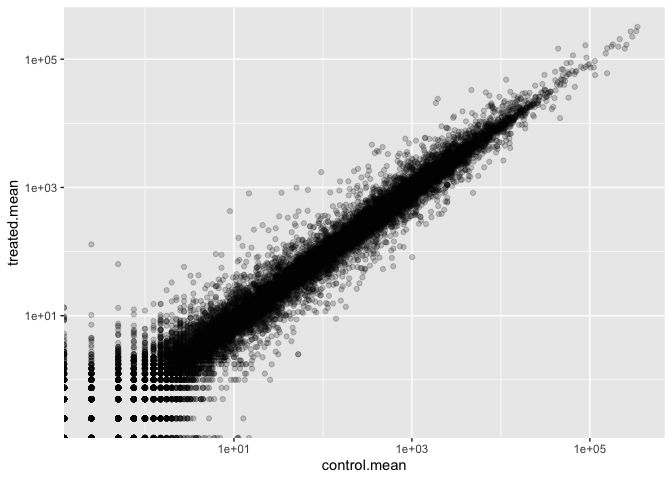
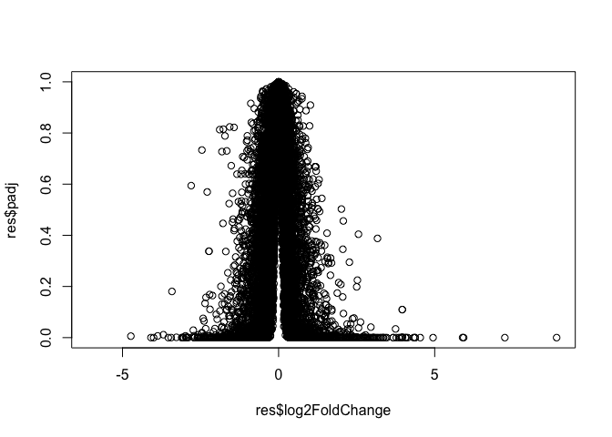
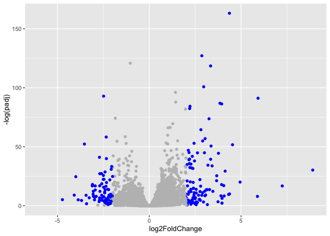

# Class 12: RNASeq with DESeq1
Rachel Field PID A69042948

``` r
library(DESeq2)
```

\##Background

Today we will analuze some RNASeq data from Himes et al. on the effects
of a common steroid (dexmethasone also called “dex”) on airway smooth
muscle cells (ASMs).

For this analysis we need two main inputs. -`contData`: a table of
**counts** (in rows) across experiments (in columns) -`colData`:
**metadata** about the design of the experiments. The rows here must
match the columns in `countdata`

\##Data Import

``` r
counts <- read.csv("airway_scaledcounts.csv", row.names=1)
metadata <- read.csv("airway_metadata.csv")
```

Let’s have a wee peak at our `counts` data.

``` r
head(counts)
```

                    SRR1039508 SRR1039509 SRR1039512 SRR1039513 SRR1039516
    ENSG00000000003        723        486        904        445       1170
    ENSG00000000005          0          0          0          0          0
    ENSG00000000419        467        523        616        371        582
    ENSG00000000457        347        258        364        237        318
    ENSG00000000460         96         81         73         66        118
    ENSG00000000938          0          0          1          0          2
                    SRR1039517 SRR1039520 SRR1039521
    ENSG00000000003       1097        806        604
    ENSG00000000005          0          0          0
    ENSG00000000419        781        417        509
    ENSG00000000457        447        330        324
    ENSG00000000460         94        102         74
    ENSG00000000938          0          0          0

and the `metadata`

``` r
head(metadata)
```

              id     dex celltype     geo_id
    1 SRR1039508 control   N61311 GSM1275862
    2 SRR1039509 treated   N61311 GSM1275863
    3 SRR1039512 control  N052611 GSM1275866
    4 SRR1039513 treated  N052611 GSM1275867
    5 SRR1039516 control  N080611 GSM1275870
    6 SRR1039517 treated  N080611 GSM1275871

> Q1 How many “genes” are in this dataset?

``` r
nrow(counts)
```

    [1] 38694

38694

> Q2. How many experiments (i.e. columns in `counts` or rows in
> `metadata`) are there?

``` r
ncol(counts)
```

    [1] 8

8 experiments.

> Q3. How many control experiments are there in the dataset?

``` r
sum(metadata$dex == "control")
```

    [1] 4

4 control experiments.

1.  Extract the “control” columns from `counts`
2.  Calculate the mean value for each gene in these “control” columns.
    3-4. Do the same for the “treated” columns
3.  Compare these mean values for each gene

Step 1

``` r
control.inds <- metadata$dex=="control"
control.counts <- counts[ , control.inds]
```

Step 2

``` r
control.mean <- rowMeans(control.counts)
```

Step 3

``` r
treated.inds <- metadata$dex=="treated"
treated.counts <- counts[ , treated.inds]
```

Step 4

``` r
treated.mean <- rowMeans(treated.counts)
```

For ease of book-keeping we can store these together in one data frame
called `meancounts`

``` r
meancounts <- data.frame(control.mean, treated.mean)
head(meancounts)
```

                    control.mean treated.mean
    ENSG00000000003       900.75       658.00
    ENSG00000000005         0.00         0.00
    ENSG00000000419       520.50       546.00
    ENSG00000000457       339.75       316.50
    ENSG00000000460        97.25        78.75
    ENSG00000000938         0.75         0.00

``` r
library(ggplot2)
ggplot(meancounts, aes(control.mean, treated.mean)) +
  geom_point(alpha=0.2)
```


This is screaming at me to log transform!

``` r
library(ggplot2)
ggplot(meancounts, aes(control.mean, treated.mean)) +
  geom_point(alpha=0.2) +
  scale_x_log10()+
  scale_y_log10()
```

    Warning in scale_x_log10(): log-10 transformation introduced infinite values.

    Warning in scale_y_log10(): log-10 transformation introduced infinite values.



We can use log2 “fold-change” as a way to compare. Fold change:
treated/controls

``` r
#treated/control
log2(10/10)
```

    [1] 0

``` r
log2(20/10)
```

    [1] 1

``` r
log2(10/20)
```

    [1] -1

``` r
log2(40/10)
```

    [1] 2

So no change is a log2 of 0

``` r
meancounts$log2fc <- log2(meancounts$treated.mean/meancounts$control.mean)
head(meancounts)
```

                    control.mean treated.mean      log2fc
    ENSG00000000003       900.75       658.00 -0.45303916
    ENSG00000000005         0.00         0.00         NaN
    ENSG00000000419       520.50       546.00  0.06900279
    ENSG00000000457       339.75       316.50 -0.10226805
    ENSG00000000460        97.25        78.75 -0.30441833
    ENSG00000000938         0.75         0.00        -Inf

A common rule of thumb threshold for calling something “up” regulated is
a log2-fold-change of +2 or greater. For down regulated -2 or less.

\##Filter out zero count genes

``` r
nonzero.inds <- rowSums(counts)!=0
mycounts <-meancounts[nonzero.inds,]
```

Alternative method

``` r
x<-c(1,5,0,5)
which(x==0)
```

    [1] 3

``` r
y<-data.frame(a=c(1,5,0,5), b = c(1,5,0,5))
y
```

      a b
    1 1 1
    2 5 5
    3 0 0
    4 5 5

``` r
y==0
```

             a     b
    [1,] FALSE FALSE
    [2,] FALSE FALSE
    [3,]  TRUE  TRUE
    [4,] FALSE FALSE

``` r
which(y==0)
```

    [1] 3 7

``` r
which(y==0, arr.ind =TRUE)
```

         row col
    [1,]   3   1
    [2,]   3   2

``` r
head(meancounts[,1:2]==0)
```

                    control.mean treated.mean
    ENSG00000000003        FALSE        FALSE
    ENSG00000000005         TRUE         TRUE
    ENSG00000000419        FALSE        FALSE
    ENSG00000000457        FALSE        FALSE
    ENSG00000000460        FALSE        FALSE
    ENSG00000000938        FALSE         TRUE

``` r
zero.inds <- which(meancounts[,1:2] ==0, arr.ind=T)
head(meancounts[-zero.inds,])
```

                    control.mean treated.mean      log2fc
    ENSG00000000419       520.50       546.00  0.06900279
    ENSG00000000457       339.75       316.50 -0.10226805
    ENSG00000000460        97.25        78.75 -0.30441833
    ENSG00000000971      5219.00      6687.50  0.35769358
    ENSG00000001036      2327.00      1785.75 -0.38194109
    ENSG00000001084       755.75       578.00 -0.38683958

``` r
zero.inds <- which(meancounts[,1:2] ==0, arr.ind = T)[,1]
mygenes<-meancounts[-zero.inds,]
```

> Q4. How many genes are “up” regulated at the +2 log2FC threshold?

``` r
sum(mygenes$log2fc >= "2")
```

    [1] 314

> Q5. How many genes are “down” regulated at the +2 log2FC threshold?

``` r
sum(mygenes$log2fc <= "-2")
```

    [1] 13238

This method isn’t great because it doesn’t consider significance

\##DESeq analysis

Let’s do this with DESeq2 and put some stats behind these numbers.

``` r
library(DESeq2)
```

DESeq wants 3 things for analysis, countData, colData, design.

``` r
dds <- DESeqDataSetFromMatrix(countData = counts, 
                       colData = metadata,
                       design = ~dex)
```

    converting counts to integer mode

    Warning in DESeqDataSet(se, design = design, ignoreRank): some variables in
    design formula are characters, converting to factors

The main function in the DESeq package to run analysis is called
`DESeq()`

``` r
dds <- DESeq(dds)
```

    estimating size factors

    estimating dispersions

    gene-wise dispersion estimates

    mean-dispersion relationship

    final dispersion estimates

    fitting model and testing

Get the results out of this DESeq object with the function `results()`

``` r
res <- results(dds)
head(res)
```

    log2 fold change (MLE): dex treated vs control 
    Wald test p-value: dex treated vs control 
    DataFrame with 6 rows and 6 columns
                      baseMean log2FoldChange     lfcSE      stat    pvalue
                     <numeric>      <numeric> <numeric> <numeric> <numeric>
    ENSG00000000003 747.194195      -0.350703  0.168242 -2.084514 0.0371134
    ENSG00000000005   0.000000             NA        NA        NA        NA
    ENSG00000000419 520.134160       0.206107  0.101042  2.039828 0.0413675
    ENSG00000000457 322.664844       0.024527  0.145134  0.168996 0.8658000
    ENSG00000000460  87.682625      -0.147143  0.256995 -0.572550 0.5669497
    ENSG00000000938   0.319167      -1.732289  3.493601 -0.495846 0.6200029
                         padj
                    <numeric>
    ENSG00000000003  0.163017
    ENSG00000000005        NA
    ENSG00000000419  0.175937
    ENSG00000000457  0.961682
    ENSG00000000460  0.815805
    ENSG00000000938        NA

Why the adjusted p value?

``` r
36000*0.05
```

    [1] 1800

You don’t want to do 1800 experiments

\##Volcano plot

This is a plot of log2FC (x) vs adjusted p value (y)

``` r
plot(res$log2FoldChange, res$padj)
```



``` r
plot(res$log2FoldChange, log(res$padj))
```


``` r
plot(res$log2FoldChange, -log(res$padj))
abline(v=c(-2,2), col="red")
abline(h=-log(0.05), col = "red")
```


``` r
-log(0.00000005)
```

    [1] 16.81124

``` r
-log(0.1)
```

    [1] 2.302585

\##Save our result

``` r
write.csv(res, file="myresults.csv")
```

``` r
library(ggplot2)

mycols <- rep("grey", nrow(res))
mycols[abs(res$log2FoldChange) >= 2] <- "blue"
mycols[res$padj >=0.5] <- "gray"

ggplot(res)+
  aes(log2FoldChange, -log(padj)) +
  geom_point(col=mycols)
```

    Warning: Removed 23549 rows containing missing values or values outside the scale range
    (`geom_point()`).



\#Add annotation data

We need to add gene symbols, gene names and other database ids to make
my results useful for further analysis.

``` r
head(res)
```

    log2 fold change (MLE): dex treated vs control 
    Wald test p-value: dex treated vs control 
    DataFrame with 6 rows and 6 columns
                      baseMean log2FoldChange     lfcSE      stat    pvalue
                     <numeric>      <numeric> <numeric> <numeric> <numeric>
    ENSG00000000003 747.194195      -0.350703  0.168242 -2.084514 0.0371134
    ENSG00000000005   0.000000             NA        NA        NA        NA
    ENSG00000000419 520.134160       0.206107  0.101042  2.039828 0.0413675
    ENSG00000000457 322.664844       0.024527  0.145134  0.168996 0.8658000
    ENSG00000000460  87.682625      -0.147143  0.256995 -0.572550 0.5669497
    ENSG00000000938   0.319167      -1.732289  3.493601 -0.495846 0.6200029
                         padj
                    <numeric>
    ENSG00000000003  0.163017
    ENSG00000000005        NA
    ENSG00000000419  0.175937
    ENSG00000000457  0.961682
    ENSG00000000460  0.815805
    ENSG00000000938        NA

We have ENSEMBLE database ids in our`res` object

``` r
head(rownames(res))
```

    [1] "ENSG00000000003" "ENSG00000000005" "ENSG00000000419" "ENSG00000000457"
    [5] "ENSG00000000460" "ENSG00000000938"

We can use the `mapIDs` function from bioconductor to help us.

``` r
library("AnnotationDbi")
library("org.Hs.eg.db")
```

Let’s see what database id formats we can translate between

``` r
columns(org.Hs.eg.db)
```

     [1] "ACCNUM"       "ALIAS"        "ENSEMBL"      "ENSEMBLPROT"  "ENSEMBLTRANS"
     [6] "ENTREZID"     "ENZYME"       "EVIDENCE"     "EVIDENCEALL"  "GENENAME"    
    [11] "GENETYPE"     "GO"           "GOALL"        "IPI"          "MAP"         
    [16] "OMIM"         "ONTOLOGY"     "ONTOLOGYALL"  "PATH"         "PFAM"        
    [21] "PMID"         "PROSITE"      "REFSEQ"       "SYMBOL"       "UCSCKG"      
    [26] "UNIPROT"     

``` r
res$symbol <- mapIds(org.Hs.eg.db,
                     keys=row.names(res), # Our genenames
                     keytype="ENSEMBL",        # The format of our genenames
                     column="SYMBOL",          # The new format we want to add
                     multiVals="first")
```

    'select()' returned 1:many mapping between keys and columns

``` r
head(res$symbol)
```

    ENSG00000000003 ENSG00000000005 ENSG00000000419 ENSG00000000457 ENSG00000000460 
           "TSPAN6"          "TNMD"          "DPM1"         "SCYL3"         "FIRRM" 
    ENSG00000000938 
              "FGR" 

Add `GENENAME` then `ENTREZID`

``` r
res$genename <- mapIds(org.Hs.eg.db,
                     keys=row.names(res), # Our genenames
                     keytype="ENSEMBL",        # The format of our genenames
                     column="GENENAME",          # The new format we want to add
                     multiVals="first")
```

    'select()' returned 1:many mapping between keys and columns

``` r
head(res$genename)
```

                                                  ENSG00000000003 
                                                  "tetraspanin 6" 
                                                  ENSG00000000005 
                                                    "tenomodulin" 
                                                  ENSG00000000419 
    "dolichyl-phosphate mannosyltransferase subunit 1, catalytic" 
                                                  ENSG00000000457 
                                       "SCY1 like pseudokinase 3" 
                                                  ENSG00000000460 
      "FIGNL1 interacting regulator of recombination and mitosis" 
                                                  ENSG00000000938 
                 "FGR proto-oncogene, Src family tyrosine kinase" 

``` r
res$entrezid <- mapIds(org.Hs.eg.db,
                     keys=row.names(res), # Our genenames
                     keytype="ENSEMBL",        # The format of our genenames
                     column="ENTREZID",          # The new format we want to add
                     multiVals="first")
```

    'select()' returned 1:many mapping between keys and columns

``` r
head(res$entrezid)
```

    ENSG00000000003 ENSG00000000005 ENSG00000000419 ENSG00000000457 ENSG00000000460 
             "7105"         "64102"          "8813"         "57147"         "55732" 
    ENSG00000000938 
             "2268" 

\##Save my annotated result

``` r
write.csv(res, file = "myresults_annotated.csv")
```

\##10. Pathway analysis

We will use the **gage** function from bioconductor.

``` r
library(pathview)
```

    ##############################################################################
    Pathview is an open source software package distributed under GNU General
    Public License version 3 (GPLv3). Details of GPLv3 is available at
    http://www.gnu.org/licenses/gpl-3.0.html. Particullary, users are required to
    formally cite the original Pathview paper (not just mention it) in publications
    or products. For details, do citation("pathview") within R.

    The pathview downloads and uses KEGG data. Non-academic uses may require a KEGG
    license agreement (details at http://www.kegg.jp/kegg/legal.html).
    ##############################################################################

``` r
library(gage)
```

``` r
library(gageData)

data(kegg.sets.hs)

# Examine the first 2 pathways in this kegg set for humans
head(kegg.sets.hs, 2)
```

    $`hsa00232 Caffeine metabolism`
    [1] "10"   "1544" "1548" "1549" "1553" "7498" "9"   

    $`hsa00983 Drug metabolism - other enzymes`
     [1] "10"     "1066"   "10720"  "10941"  "151531" "1548"   "1549"   "1551"  
     [9] "1553"   "1576"   "1577"   "1806"   "1807"   "1890"   "221223" "2990"  
    [17] "3251"   "3614"   "3615"   "3704"   "51733"  "54490"  "54575"  "54576" 
    [25] "54577"  "54578"  "54579"  "54600"  "54657"  "54658"  "54659"  "54963" 
    [33] "574537" "64816"  "7083"   "7084"   "7172"   "7363"   "7364"   "7365"  
    [41] "7366"   "7367"   "7371"   "7372"   "7378"   "7498"   "79799"  "83549" 
    [49] "8824"   "8833"   "9"      "978"   

What **gage** wants as input is a named vector of importance i.e. a
vector with labeled fold-changes.

``` r
foldchanges = res$log2FoldChange
names(foldchanges) = res$entrezid
head(foldchanges)
```

           7105       64102        8813       57147       55732        2268 
    -0.35070296          NA  0.20610728  0.02452701 -0.14714263 -1.73228897 

Run gage analysis:

``` r
# Get the results
keggres = gage(foldchanges, gsets=kegg.sets.hs)
```

``` r
attributes(keggres)
```

    $names
    [1] "greater" "less"    "stats"  

``` r
head(keggres$less, 5)
```

                                                             p.geomean stat.mean
    hsa05332 Graft-versus-host disease                    0.0004250607 -3.473335
    hsa04940 Type I diabetes mellitus                     0.0017820379 -3.002350
    hsa05310 Asthma                                       0.0020046180 -3.009045
    hsa04672 Intestinal immune network for IgA production 0.0060434609 -2.560546
    hsa05330 Allograft rejection                          0.0073679547 -2.501416
                                                                 p.val      q.val
    hsa05332 Graft-versus-host disease                    0.0004250607 0.09053792
    hsa04940 Type I diabetes mellitus                     0.0017820379 0.14232788
    hsa05310 Asthma                                       0.0020046180 0.14232788
    hsa04672 Intestinal immune network for IgA production 0.0060434609 0.31387487
    hsa05330 Allograft rejection                          0.0073679547 0.31387487
                                                          set.size         exp1
    hsa05332 Graft-versus-host disease                          40 0.0004250607
    hsa04940 Type I diabetes mellitus                           42 0.0017820379
    hsa05310 Asthma                                             29 0.0020046180
    hsa04672 Intestinal immune network for IgA production       47 0.0060434609
    hsa05330 Allograft rejection                                36 0.0073679547

Let’s look at just one of these hsa05310.

``` r
library(pathview)
pathview(gene.data=foldchanges, pathway.id="hsa05310")
```

    'select()' returned 1:1 mapping between keys and columns

    Info: Working in directory /Users/rachelfield/Desktop/UCSD BioSci PhD/Classes Fall 2025/Foundations of Bioinformatics/bggn213_github/class12 transcriptomics

    Info: Writing image file hsa05310.pathview.png

Insert figure for this pathway 
